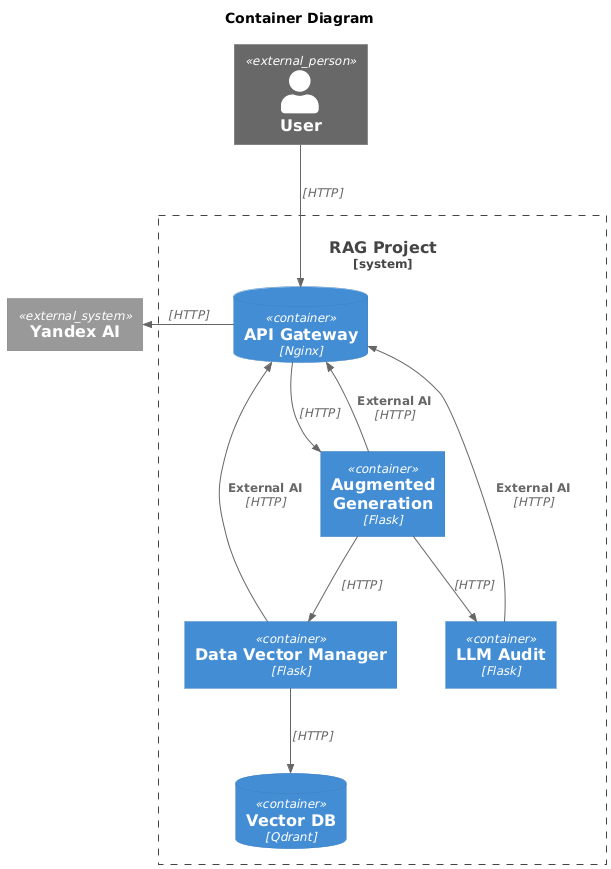

# Retrieval Augmented Generation Project

## 📋 Overview

### 🏗️ Components

* **Flask** - Lightweight WSGI web framework for Python, designed for rapid development and easy deployment of web applications.
* **LangChain** - Framework for developing applications powered by language models, providing tools for data retrieval, processing, and orchestration of LLM workflows.
* **Qdrant** - High-performance vector database optimized for similarity search and machine learning applications, supporting efficient storage and retrieval of vector embeddings.
* **Yandex GPT** - Comprehensive artificial intelligence platform offering a range of machine learning tools and services, including natural language processing, speech recognition, and computer vision capabilities.

### 📊 Diagrams




## 🛠️ Installation

### Getting Started

```bash
pip install -r requirements.txt
```

llm-audit

```bash
python -m spacy download ru_core_news_sm
```

### Configuration

```bash
cp .env.example .env
```

## License

This project is licensed under the MIT License - see the LICENSE file for details.