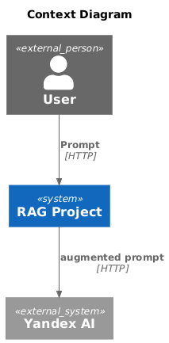

# Retrieval Augmented Generation Project

## 🗒 TODO

- [ ] Migrate services from Flask to FastAPI
- [ ] Switch the LangChain driver from Yandex to OpenAI
- [ ] Implement unit tests
- [ ] Split the augmented‑generation component into two separate services
- [ ] Add an API gateway


## 📋 Overview

### 🏗️ Components

* **Flask** - Lightweight WSGI web framework for Python, designed for rapid development and easy deployment of web applications.
* **LangChain** - Framework for developing applications powered by language models, providing tools for data retrieval, processing, and orchestration of LLM workflows.
* **Qdrant** - High-performance vector database optimized for similarity search and machine learning applications, supporting efficient storage and retrieval of vector embeddings.
* **Yandex GPT** - Comprehensive artificial intelligence platform offering a range of machine learning tools and services, including natural language processing, speech recognition, and computer vision capabilities.

### 📊 Diagrams




## 🛠️ Installation

### Getting Started

```bash
docker compose up -d
```

### Configuration

```bash
cp .env.example .env
```

## 💻 System Endpoints Overview

- Qdrant - http://localhost:6333
- data-vector-manager - http://localhost:8001
- augmentes-generation - http://localhost:8001
- llm-audit - http://localhost:8003
- mcp-server - http://localhost:3000
- mcp-client - http://localhost:8004


Swagger UI - /api/docs

## License

This project is licensed under the MIT License - see the LICENSE file for details.